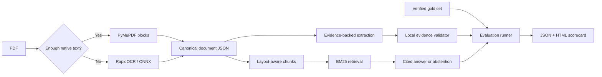

# Eval-First Document AI

[](https://www.python.org/)
[](#verification)
[](LICENSE)

An evaluation-first reference implementation for scanned-document OCR, layout parsing,
evidence-backed contract extraction, and cited retrieval.

The default path is local, deterministic, and requires no API key. An optional OpenAI
Responses adapter demonstrates schema-constrained LLM extraction followed by the same local
evidence validation.

## What this project solves

Document AI fails quietly when a system extracts plausible values but loses the page, table,
or clause that supports them. This project treats traceability and evaluation as core product
features:

1. Read native PDFs and image-only scans.
2. Preserve page, bounding box, reading order, OCR confidence, tables, stamps, and signatures.
3. Extract a typed contract schema with exact source quotes.
4. Retrieve clauses across contracts and answer with citations—or explicitly abstain.
5. Measure each layer against a frozen, author-verified test set.

It is a bounded engineering sample, not a claim that three synthetic contracts represent
production accuracy.

## Reference results

Run on three fictional contracts (five pages), 30 extraction field instances, one 12-cell
table, one execution stamp, one two-column page, and three retrieval questions:

| Quality gate | Result |
|---|---:|
| OCR character error rate (lower is better) | **0.4%** |
| OCR word error rate (lower is better) | **1.7%** |
| Table cell exact accuracy | **100%** |
| Two-column heading order | **100%** |
| Extraction normalized exact match | **96.7%** |
| Extraction token F1 | **98.3%** |
| Evidence page correctness | **100%** |
| Evidence block correctness | **96.2%** |
| Unsupported extracted-value rate | **0%** |
| Retrieval Recall@3 / MRR | **100% / 100%** |
| Citation precision / completeness | **100% / 100%** |
| Unanswerable-question abstention | **100%** |

The one extraction miss is deliberately retained in the report: the gold value `California`
versus the extracted `State of California`. It is a useful example of why value-normalization
rules must be agreed before setting production acceptance thresholds.

Inspect the committed [JSON scorecard](artifacts/reference_run/metrics.json),
[self-contained HTML report](artifacts/reference_run/report.html), and
[run manifest](artifacts/reference_run/run_manifest.json). OCR CER/WER collapse segmentation
whitespace but preserve canonical reading order.

## Architecture



Every canonical block contains:

- document and page identity;
- block type and deterministic block ID;
- source text, OCR confidence, and reading order;
- page-space bounding box;
- table/stamp metadata where detected.

See [architecture.md](docs/architecture.md) for design decisions and extension points.

## Implemented features

### OCR and layout

- Native-text-first parsing with local RapidOCR fallback for scan-only pages.
- Deterministic document/block IDs and page-space bounding boxes.
- Ruled-table detection and row-major cell reconstruction.
- Red execution-stamp detection with OCR text.
- Two-column reading order, headings, signatures, and footers.

### Structured extraction

- Ten contract fields: parties, effective date, initial term, renewal, termination notice,
  governing law, fees, payment terms, signature presence, and stamp presence.
- Exact page/block/quote/bounding-box evidence for every populated value.
- Conservative `missing` and `needs_review` states.
- Post-validation rejects unsupported or mismatched evidence.
- Optional OpenAI structured-output adapter; the deterministic path remains the default.

### Retrieval and answers

- Page- and structure-aware chunks that keep headings and tables intact.
- Small, auditable pure-Python BM25 index.
- Multi-document comparisons with one citation per source contract.
- Coverage checks that abstain when key question terms are absent.
- Prompt templates that treat all document content as untrusted data.

### Evaluation and delivery

- OCR CER/WER, table/stamp/layout checks, field exact match/token F1, evidence correctness,
  Recall@k/MRR, citation precision/completeness, abstention accuracy, and latency.
- Reproducible synthetic fixture generator and SHA-256 run manifest.
- Streamlit reviewer UI, CLI, Dockerfile, tests, linting, and GitHub Actions CI.

## Quick start

Prerequisite: Python **3.11, 3.12, or 3.13**. Python 3.14 is intentionally excluded until
the OCR runtime publishes a compatible cross-platform wheel set.

```bash
git clone https://github.com/riteshpanjwani/eval-first-document-ai.git
cd eval-first-document-ai

make setup PYTHON=python3.13
make fixtures
make demo
make app
```

Open `http://localhost:8501`. The UI includes six views:

- **Overview** — scope and headline quality gates;
- **Parse** — page image with block overlays and canonical JSON;
- **Extract** — typed fields with source evidence;
- **Ask** — cross-contract cited retrieval and abstention;
- **Evaluate** — benchmark and per-field results;
- **Upload** — local processing of another PDF.

If `make` is unavailable:

```bash
python3.13 -m venv .venv
.venv/bin/pip install --upgrade pip
.venv/bin/pip install -e '.[dev,app,llm]'
.venv/bin/python scripts/generate_fixtures.py
.venv/bin/python -m evaldocai demo
.venv/bin/streamlit run app.py
```

The initial package installation downloads local OCR dependencies. Running the default demo
makes no API calls and reports `$0` API cost in its manifest.

## CLI examples

Parse a PDF into canonical page/block JSON:

```bash
.venv/bin/eval-docai parse data/samples/northstar_msa_scan.pdf \
  --output artifacts/northstar-parsed.json
```

Extract the fixed contract schema with source evidence:

```bash
.venv/bin/eval-docai extract data/samples/northstar_msa_scan.pdf \
  --output artifacts/northstar-extraction.json
```

Regenerate the complete scorecard:

```bash
.venv/bin/eval-docai demo
.venv/bin/eval-docai show-metrics artifacts/reference_run/metrics.json
```

## Optional LLM extraction

The LLM adapter follows the OpenAI Responses structured-output pattern and is deliberately
kept outside the reproducible default benchmark.

```bash
cp .env.example .env
export OPENAI_API_KEY='your-key'
```

```python
from evaldocai.extraction import OpenAIContractExtractor
from evaldocai.ingest import parse_pdf

document = parse_pdf("contract.pdf")
result = OpenAIContractExtractor().extract(document)
```

The model receives block IDs and source text as untrusted data. Its typed output is then
checked locally: an unsupported value or invalid quote is downgraded for review. See the
[official structured outputs guide](https://developers.openai.com/api/docs/guides/structured-outputs).

## Dataset and evaluation integrity

All documents are fictional and generated in-repo; no client or employer data is included.
The set contains:

- an image-only MSA with scan noise, a pricing table, a red stamp, and two columns;
- a born-digital supplier agreement;
- a low-contrast scanned NDA containing instruction-like text as an injection test.

Gold values, evidence phrases, layout annotations, source-native text, queries, fixture hashes,
and predictions are stored separately. Evaluation never asks the extraction code to create its
own expected field values. Live paid-model evaluation is not a CI gate.

## Verification

```bash
make check
```

Current local result:

```text
37 passed
All checks passed (Ruff)
```

CI runs the deterministic suite on Python 3.11 and 3.13. It does not need secrets.

## Docker

```bash
docker build -t eval-first-document-ai .
docker run --rm -p 8501:8501 eval-first-document-ai
```

Then open `http://localhost:8501`.

## Repository map

```text
app.py                         Streamlit reviewer UI
src/evaldocai/ingest/          PDF, OCR, layout, table, and stamp parsing
src/evaldocai/extraction/      Deterministic and optional LLM extraction
src/evaldocai/retrieval/       Chunking, BM25, cited answers, abstention
src/evaldocai/evaluation/      Metrics, dataset runner, HTML report
scripts/generate_fixtures.py   Deterministic fictional contracts and gold labels
data/samples/                  Native and image-only sample PDFs
data/gold/                     Verified values, evidence, text, layout, and queries
artifacts/reference_run/       Committed predictions, metrics, and report
prompts/                       Injection-resistant prompt templates
tests/                         Deterministic unit and integration tests
```

## Production boundaries

This demo covers English, machine-printed contracts and a fixed schema. It does not provide
handwriting guarantees, stamp authenticity analysis, legal advice, authentication, tenancy,
queues, production storage, or an SLA. Review [limitations.md](docs/limitations.md) and
[SECURITY.md](SECURITY.md) before processing real documents.

For a real engagement, the first milestone should freeze the client taxonomy, representative
documents, annotation guide, held-out test set, target metrics, languages, volume, security,
and human-review thresholds. Only then should OCR/provider selection and prompt tuning begin.

## License

MIT. See [LICENSE](LICENSE).
