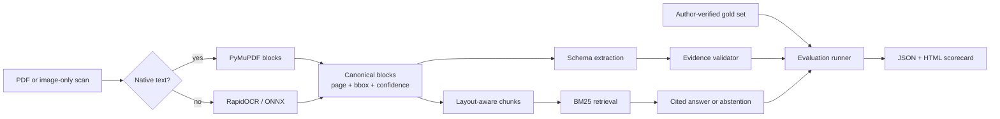

# Architecture

The demo deliberately keeps provider-specific OCR and LLM code at the edges. The core uses a
canonical document model so extraction, retrieval, and evaluation do not depend on one vendor.

## Design decisions

- **Evidence is first-class.** Every extracted value points to a page, block, quote, and bounding box.
- **Confidence is deterministic.** Low OCR confidence, missing quotes, or failed normalization triggers
  review; an LLM is never allowed to declare itself trustworthy.
- **Documents are untrusted data.** Prompt-like text inside a contract cannot override extraction or
  answer instructions.
- **Abstention is a feature.** The answer path returns “not found” when retrieval evidence is weak.
- **Evaluation is reproducible.** Synthetic inputs, independently authored labels, cached outputs, and
  run metadata are committed together.

## Production extension points

The local OCR baseline can be replaced by Docling, PaddleOCR/PP-Structure, Azure Document Intelligence,
Google Document AI, or Amazon Textract without changing downstream schemas. Likewise, BM25 can be fused
with dense embeddings for a production hybrid index.
